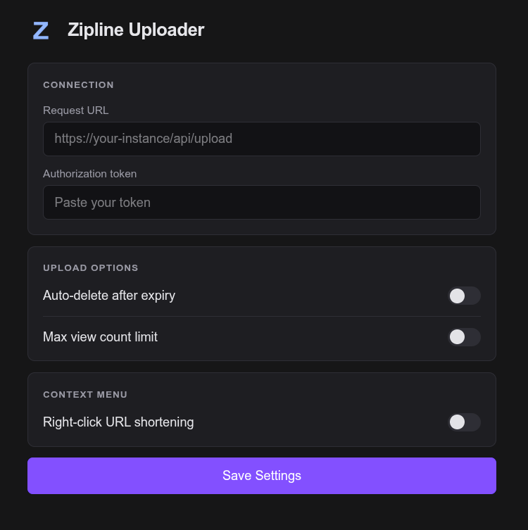

# Upload to Zipline

A browser extension that uploads media to Zipline directly from the right-click menu, with optional URL shortening, auto-delete, and view-count limits — all configurable from the toolbar popup.

[](https://addons.mozilla.org/en-US/firefox/addon/upload-to-zipline/)

<p align="center">
  
</p>

## Features

- Right-click any image, video, or audio → upload to your Zipline instance
- Toolbar icon opens a settings popup
- Right-click any link → "Shorten URL with Zipline" (optional)
- Auto-delete uploads after a configurable expiry (1h to 1y)
- Per-upload max view-count limit
- Automatic clipboard copy of returned URLs
- Cross-browser: Chrome and Firefox built from one codebase

## Configuration

1. Click the extension's toolbar icon to open the popup (or right-click → Manage Extension → Options for the full-page version).
2. **Request URL** — your Zipline upload endpoint, e.g. `https://your-zipline-instance.com/api/upload`.
3. **Authorization Token** — your personal Zipline auth token.
4. Toggle and configure any of the **Upload Options**: auto-delete expiry, max-views limit.
5. Toggle **Right-click URL shortening** in **Context Menu** if you want the link-shortening menu item.
6. Click **Save Settings**.

> The request URL and auth token can both be copied from your Zipline account's `.sxcu` ShareX export.

## Development

### Prerequisites

- Node.js ≥ 20
- pnpm ≥ 8

### Install

```bash
pnpm install
```

### Develop

```bash
pnpm dev            # Chromium with HMR
pnpm dev:firefox    # Firefox with HMR
```

WXT auto-launches the browser with the extension loaded.

### Build

```bash
pnpm build          # → .output/chrome-mv3/
pnpm build:firefox  # → .output/firefox-mv3/
```

Load `.output/<browser>-mv3/` unpacked in your browser:
- **Chrome:** `chrome://extensions` → enable Developer mode → "Load unpacked" → select `.output/chrome-mv3/`.
- **Firefox:** `about:debugging#/runtime/this-firefox` → "Load Temporary Add-on" → select `.output/firefox-mv3/manifest.json`.

### Type check

```bash
pnpm compile
```

### Store-ready zips

```bash
pnpm zip          # → .output/upload-to-zipline-X.Y.Z-chrome.zip
pnpm zip:firefox  # → .output/upload-to-zipline-X.Y.Z-firefox.zip
```

## Architecture

Single source tree at the repo root, built for both browsers via [WXT](https://wxt.dev). Vue 3 + TypeScript for the popup and options surfaces, Tailwind v4 for styling. Background service worker (Chrome) / event page (Firefox) is a single `entrypoints/background.ts`. Settings are stored in `browser.storage.sync` so they roam across signed-in browsers.

```
entrypoints/    # background, popup, options
components/     # SettingsForm, ToggleSwitch, StatusMessage
composables/    # useSettings (typed storage wrapper)
types/          # Settings interface + presets
assets/         # Tailwind entry stylesheet
public/         # static icons
wxt.config.ts   # manifest + browser targets
```

## License

GNU General Public License v3.0 — see [LICENSE](LICENSE).
